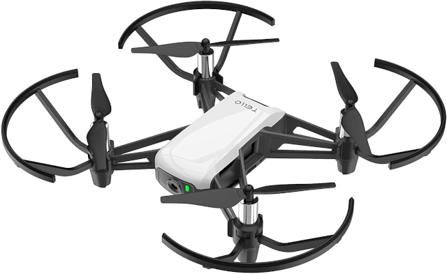

# Face Track Tello

A face tracking Tello drone



## Hardware

* [TELLO](https://www.ryzerobotics.com/tello)

## Software

* [Python 3](https://www.python.org/)
* [Open CV](https://opencv.org/)

## Install package

```bash
python3 -m venv venv
. venv/bin/activate
pip3 install --upgrade pip wheel setuptools
pip3 install --upgrade -e .
```

## Install requirements

```bash
pip install -r requirements.txt
```

## Usage

```bash
python3 -m face_track
face_track
python3 src/face_track/__main__.py
```

## Uninstall package

```bash
pip uninstall face_track
```

## Issues

* when face_track generates the following error:

```bash
Illegal instruction (core dumped)
```
  
add "export OPENBLAS_CORETYPE=ARMV8" to the bottom of the .bashrc file

```bash
echo "export OPENBLAS_CORETYPE=ARMV8" >> ~/.bashrc
```

## Notes

* use official TELLO app to update firmware
* use official TELLO app to calibrate
* fly tello in good light condition
* fly tello on flat floor with visual patterns
* face tello camera
* press any key to land tello
* tune PID parameters if tello oscillates

## Credits

This script has been adapted from following projects and tutorials.

* [I create AI tracking drone using DJI Tell](https://www.youtube.com/watch?v=rHY3T7-vK38)
* [I Forced a Drone Bot To Follow Me](https://www.youtube.com/watch?v=4KiH3Fq3olM)
* [Drone Face Tracking PID using OpenCV Pyhton](https://www.youtube.com/watch?v=P2wl3N2JW9c)
* [First DJI Tello drone face tracking test with openCV](https://www.youtube.com/watch?v=WFz5I1iRhLY)
* [Tello Drone Sandbox](https://github.com/youngsoul/tello-sandbox)
* [How to Tune a PID Controller](https://www.youtube.com/watch?v=IB1Ir4oCP5k)
* [Empirical PID gain tuning (Kevin Lynch)](https://www.youtube.com/watch?v=uXnDwojRb1g)
