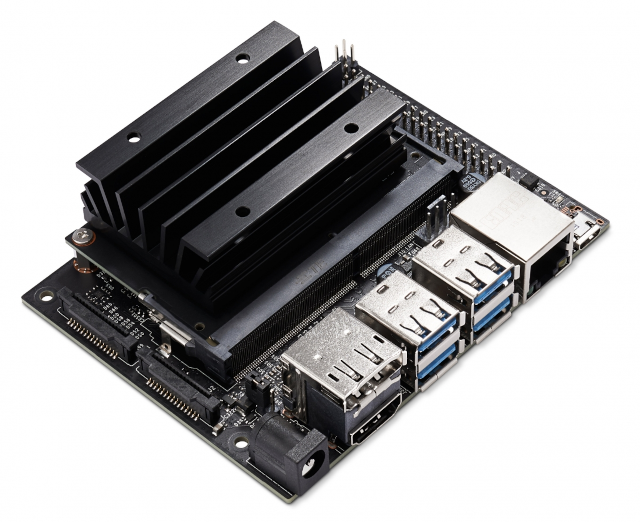
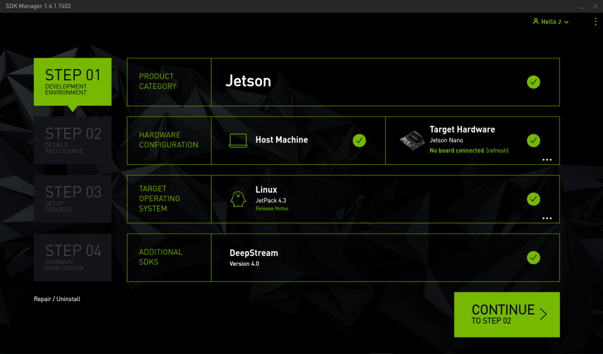
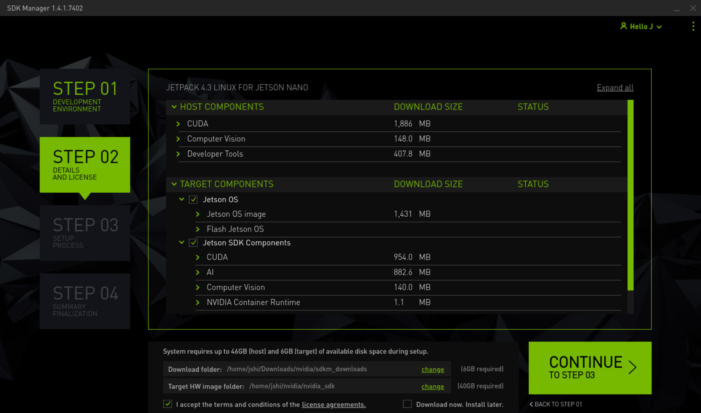
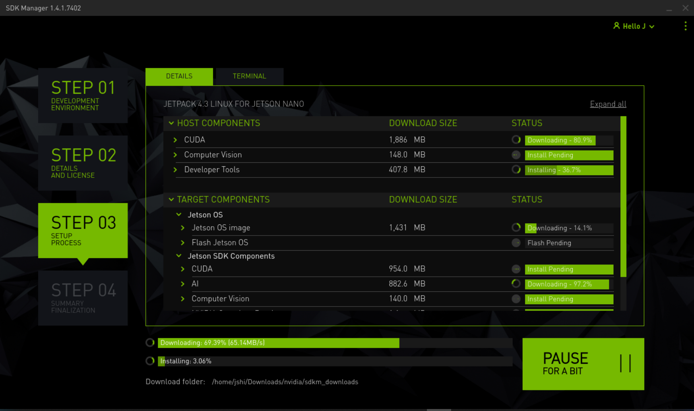
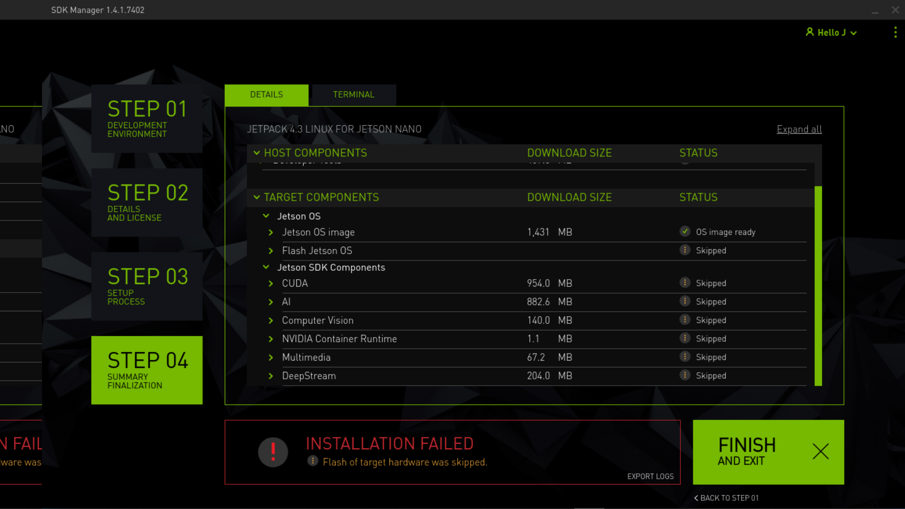

# Wind River Linux Binaries on a NVIDIA Jetson Nano

This tutorial contains all the information and steps to build Wind River Linux LTS 19 on NVIDIA Jetson Nano Developer Kit B01.
This tutorial is based on [the blog](https://blogs.windriver.com/wind_river_blog/2020/05/nvidia-container-runtime-for-wind-river-linux) by Pablo Rodriguez Quesada.

## Wind River Linux LTS 19 (Yocto 3.0 Zeus)

This tutorial builds a new distribution of [Wind River Linux LTS 19](https://github.com/WindRiver-Labs/wrlinux-x).
The tool uses a layer index, as specified in the bin/setting.py file, to determine what layers are required to construct a distributio builder project.

## OpenEmbedded/Yocto BSP layer for NVIDIA Jetson Nano (meta-tegra)

The BSP layer for NVIDIA Jetson platforms, based on L4T.
To be compatible with Wind River Linux LTS 19, branch [zeus-l4t-432.3.1](https://github.com/OE4T/meta-tegra/tree/zeus-l4t-r32.3.1) is used.  
This BSP supports Jetson Nano development kit (Linux4Tegra R32.3.1, JetPack 4.3)

## NVIDIA Jetson Nano 4GB Developer Kit B01



NVIDIA® Jetson Nano™ Developer Kit is a small, powerful computer that lets you run multiple neural networks in parallel for applications like image classification, object detection, segmentation, and speech processing. All in an easy-to-use platform that runs in as little as 5 watts.
For technical Specifications, please refer to [Jetson Nano website](https://developer.nvidia.com/embedded/jetson-nano-developer-kit).

## Build machine

This tutorial requires a [Ubuntu 18.04 LTS(Bionic Beaver)](https://releases.ubuntu.com/18.04/) as the build machine.
Use the following command to install Yocto dependencies on Ubuntu.

```bash
sudo apt-get install gawk wget git-core diffstat unzip texinfo gcc-multilib build-essential chrpath socat libsdl1.2-dev xterm
```

## JetPack SDK 4.3

The required JetPack SDK version is 4.3.

You need first install NVIDIA SDK Manager from <https://developer.nvidia.com/embedded/downloads>.
Then run SDK Manager from:

```bash
/usr/bin/sdkmanager
```



In STEP 01, choose following Target Hardware:

* Jetson Nano [developer kit version]
* P3448-0000 module
* P3449-0000 carrier board

Choose following Target Operating System:

* JetPack 4.3

&nbsp;
&nbsp;



In STEP 02, choose the required components and accept license agreements.

&nbsp;
&nbsp;



&nbsp;
&nbsp;



In STEP 04, choose not to flash target and finish.

&nbsp;
&nbsp;

After SDK is installed, you should have the following folders:

* Download folder $HOME/Downloads/nvidia/sdkm_downloads
* Target HW image folder: $HOME/nvidia/nvidia_sdk

## TensorRT

If you need to include TensorRT in your builds, you must create the subdirectory and move all of the TensorRT packages downloaded by the SDK Manager there.

```bash
mkdir /home/$USER/Downloads/nvidia/sdkm_downloads/NoDLA
cp /home/$USER/Downloads/nvidia/sdkm_downloads/libnv* /home/$USER/Downloads/nvidia/sdkm_downloads/NoDLA
```

## Wind River Linux LTS project

The setup program is expected to have been cloned inside of a project directory, such as:

```bash
mkdir $HOME/my-project
cd $HOME/my-project
git clone --branch WRLINUX_10_19_BASE https://github.com/WindRiver-Labs/wrlinux-x.git wrlinux-x
```

Once cloned, simply run the setup.sh (./wrlinux-x/setup.sh) to get a list of options. The setup program will construct a new git repository in the current working directory. This repository is used to manage the output of the setup program.

```bash
cd $HOME/my-project
./wrlinux-x/setup.sh
./wrlinux-x/setup.sh --all-layers --dl-layers --distro wrlinux-graphics
```

## meta-tegra layer

```bash
cd $HOME/my-project
git clone --branch zeus-l4t-r32.3.1 https://github.com/madisongh/meta-tegra.git layers/meta-tegra
```

```bash
cd $HOME/my-project
. ./environment-setup-x86_64-wrlinuxsdk-linux
. ./oe-init-build-env
```

```bash
cd $HOME/my-project/build
bitbake-layers add-layer ../layers/meta-tegra/
bitbake-layers add-layer ../layers/meta-tegra/contrib
bitbake-layers add-layer ../layers/meta-intel
bitbake-layers add-layer ../layers/meta-openembedded/meta-python/
bitbake-layers add-layer ../layers/meta-openembedded/meta-networking/
bitbake-layers add-layer ../layers/meta-openembedded/meta-xfce
```

## config the project

```bash
cd $HOME/my-project/build
echo "BB_NO_NETWORK = '0'" >> conf/local.conf
echo 'INHERIT_DISTRO_remove = "whitelist"' >> conf/local.conf

echo "MACHINE='jetson-nano-qspi-sd'" >> conf/local.conf
echo "PREFERRED_PROVIDER_virtual/kernel = 'linux-tegra'" >> conf/local.conf

echo 'GCCVERSION = "7.%"' >> conf/local.conf
echo "require contrib/conf/include/gcc-compat.conf" >> conf/local.conf

echo 'IMAGE_CLASSES += "image_types_tegra"' >> conf/local.conf
echo 'IMAGE_FSTYPES = "tegraflash"' >> conf/local.conf

echo 'SECURITY_CFLAGS_pn-tini_append = " ${SECURITY_NOPIE_CFLAGS}"' >> conf/local.conf

echo "NVIDIA_DEVNET_MIRROR='file:///home/$USER/Downloads/nvidia/sdkm_downloads'" >> conf/local.conf
echo 'CUDA_BINARIES_NATIVE = "cuda-binaries-ubuntu1804-native"' >> conf/local.conf

echo 'IMAGE_INSTALL_append += " cuda-samples cudnn tensorrt opencv python3-opencv "' >> conf/local.conf
echo 'IMAGE_INSTALL_append += " git dpkg gcc make cmake automake autoconf time valgrind "' >> conf/local.conf
echo 'IMAGE_INSTALL_append += " python3-pip python3 python3-modules python3-setuptools python3-venv "' >> conf/local.conf
echo 'IMAGE_INSTALL_append += " openssh-sshd openssh-scp e2fsprogs-resize2fs "' >> conf/local.conf
echo 'IMAGE_INSTALL_append += " i2c-tools can-utils spitools libsdl2-dev hdf5 zip x11vnc "' >> conf/local.conf
echo 'IMAGE_INSTALL_append += " alsa-lib alsa-utils pulseaudio vlc boost ffmpeg chromium-x11 "' >> conf/local.conf
echo 'IMAGE_INSTALL_append += " linux-firmware iw bluez5 wpa-supplicant networkmanager ca-certificates lsb-release v4l-utils dhcp-client "' >> conf/local.conf

echo 'IMAGE_INSTALL_append += " python3-dev python3-flask python3-protobuf python3-smbus python3-numpy python3-pillow python3-urllib3 python3-docopt python3-tornado python3-certifi python3-chardet python3-idna python3-requests python3-h5py python3-engineio python3-socketio python3-markupsafe python3-jinja2 python3-click python3-itsdangerous python3-werkzeug python3-dnspython python3-greenlet python3-eventlet python3-decorator python3-tqdm python3-dateutil python3-pytz python3-pandas python3-prettytable python3-paho-mqtt python3-spidev "' >> conf/local.conf

echo 'DISTRO_FEATURES_append += " ldconfig openstack wifi bluetooth bluez5 x11 "' >> conf/local.conf
echo 'PREFERRED_PROVIDER_virtual/kernel = "linux-tegra"' >> conf/local.conf

echo 'LICENSE_FLAGS_WHITELIST += " commercial commercial_libav commercial_x264 "' >> conf/local.conf

echo 'EXTRA_IMAGE_FEATURES += " tools-sdk "' >> conf/local.conf
echo 'distro_bootpart="1"' >> conf/local.conf
echo 'DISTRO_CODENAME ?= "alphaDrone"' >> conf/local.conf
echo 'WRTEMPLATE += " feature/xfce "' >> conf/local.conf
echo 'INSANE_SKIP_libcxx = "installed-vs-shipped "' >> conf/local.conf
```

## Build the project

```bash
cd $HOME/my-project/build
bitbake wrlinux-image-std
```

## Burn the image into the micro SD card

```bash
cd $HOME/my-project/build
cd ./tmp-glibc/deploy/images/jetson-nano-qspi-sd/wrlinux-image-std-jetson-nano-qspi-sd.tegraflash.zip
unzip wrlinux-image-std-jetson-nano-qspi-sd.tegraflash.zip -d wrlinux-jetson-nano
cd wrlinux-jetson-nano
```

edit dosdcard.sh for NVIDIA Jetson Nano Developer Kit B01

```bash
MACHINE=jetson-nano-qspi-sd BOARDID=${BOARDID:-3448} FAB=${FAB:-300} ./tegra210-flash-helper.sh --sdcard -B 1048576 -s 16G -b wrlinux-image-std flash.xml.in tegra210-p3448-0000-p3449-0000-b00.dtb jetson-nano-qspi-sd.cfg 0x94000 "" boot.img wrlinux-image-std.ext4 "$@"
```

then run command:

```bash
./dosdcard.sh
```

This command will create the file wrlinux-image-std.sdcard that contains the SD card image required to boot.
In order to flash it to your SD just insert your micro SD card to your PC and dump the file contents on it using dd as follows:

```bash
# IMPORTANT: Make sure you use the right device name for your micro SD card, in my case it is /dev/sdd
sudo dd if=wrlinux-image-std.sdcard of=/dev/sdd bs=10M status=progress
```

or use your favorite tool to flash the micro SD card, such as [balenaEtcher](https://www.balena.io/etcher/).

## Chromium browser

This is optional.

```bash
cd $HOME/my-project
git clone --branch zeus  https://github.com/OSSystems/meta-browser.git layers/meta-browser
git clone --branch zeus  https://github.com/kraj/meta-clang.git layers/meta-clang
```

```bash
cd $HOME/my-project/build
bitbake-layers add-layer ../layers/meta-browser/
bitbake-layers add-layer ../layers/meta-clang/
```

## Credits

This script has been adapted from following projects and tutorials.

* [NVIDIA container runtime for Wind River Linux](https://blogs.windriver.com/wind_river_blog/2020/05/nvidia-container-runtime-for-wind-river-linux/)
* [I Forced a Drone Bot To Follow Me](https://www.youtube.com/watch?v=4KiH3Fq3olM)
* [Drone Face Tracking PID using OpenCV Pyhton](https://www.youtube.com/watch?v=P2wl3N2JW9c)
* [First DJI Tello drone face tracking test with openCV](https://www.youtube.com/watch?v=WFz5I1iRhLY)
